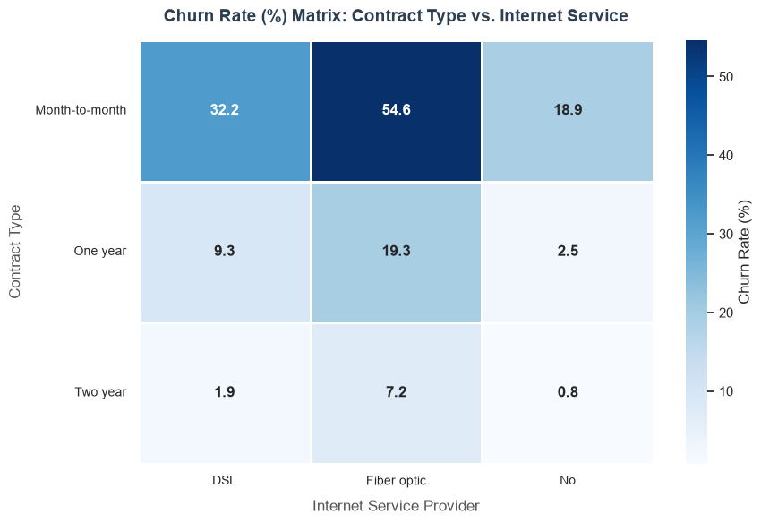
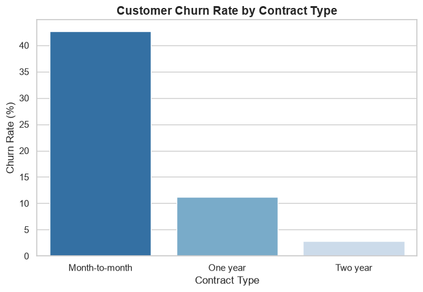
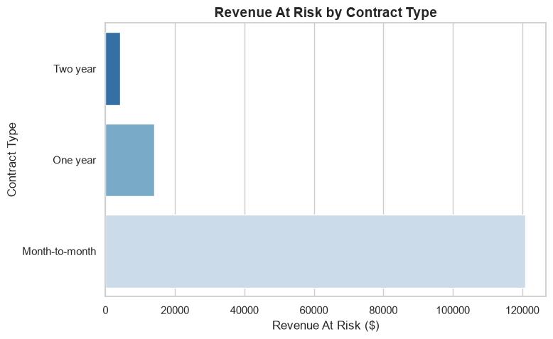
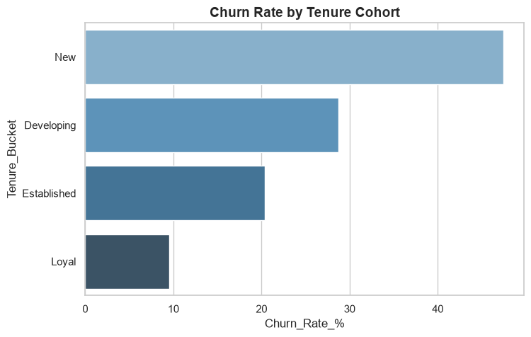

# Telecom Customer Churn Analysis
### SQL Server 2022 | Python | Pandas | Matplotlib | Seaborn

## Project Overview
End-to-end churn analysis on 7,043 IBM Telco customers using SQL Server 2022
and Python. Built a star schema database from scratch, performed full ETL,
wrote advanced SQL queries and visualized key business insights in Python.

## Business Problem
A telecom company is experiencing high customer churn. This analysis identifies
the key drivers of churn and quantifies the revenue at risk to enable
data-driven retention decisions.

## Tools Used
- SQL Server 2022 (SSMS) — database design, ETL, analysis
- Python — Pandas, Matplotlib, Seaborn
- GitHub — version control and portfolio

## Database Design
Star schema with 4 tables:
- `fact_churn` — core metrics (7,043 rows)
- `dim_customer` — customer demographics
- `dim_services` — service subscriptions
- `dim_contract` — contract and payment details

## SQL Techniques Used
- CTEs (Common Table Expressions)
- Window Functions (ROW_NUMBER, RANK, SUM OVER)
- Cohort Analysis
- Stored Procedures with parameters
- Views
- Multi-table JOINs
- CASE WHEN logic

## Key Business Insights

**1. The Churn Crisis is a Revenue Crisis**
With a 26.54% churn rate, the company loses nearly one in three customers
every cycle. Churned customers paid $74.44/month vs $61.27 for retained
customers — putting $139,131 of monthly revenue at risk (30.5% of total).

**2. Contract Flexibility is the Biggest Churn Driver**
Month-to-month customers churn at 42.71% — 15x higher than two-year
customers at 2.83%. Month-to-month contracts account for $120,847 in
monthly revenue at risk — 87% of total revenue at risk.

**3. The First 12 Months Define the Customer Relationship**
New customers (0–12 months) churn at 47.44%. Loyal customers (49–72 months)
churn at just 9.51%. Retaining customers through their first year is the
single highest-leverage intervention available.

**4. Fiber Optic + Month-to-Month = Highest Risk Segment**
Month-to-month Fiber optic customers churn at 54.6%. The same customers
on two-year contracts churn at just 7.2%. Contract structure — not product
quality — is the problem.

**5. High-Value Customers Need Proactive Retention**
Top 10 highest-value churned customers represent $1,144 in lost monthly
revenue. Electronic check users churn at 45.29% vs 15-17% for automatic
payment users.

## Charts

### Churn Rate by Contract Type

### Revenue at Risk by Contract Type

### Churn Rate by Tenure Cohort

### Churn Rate Matrix: Contract Type vs Internet Service

## Dataset
IBM Telco Customer Churn — [Kaggle](https://www.kaggle.com/datasets/blastchar/telco-customer-churn)
7,043 customers, 21 features

## Author
**Muhammad Aqib Khan**
Statistical Officer | Data Analyst
[LinkedIn](https://www.linkedin.com/in/your-profile) | [GitHub](https://github.com/Aqibkhan001)
